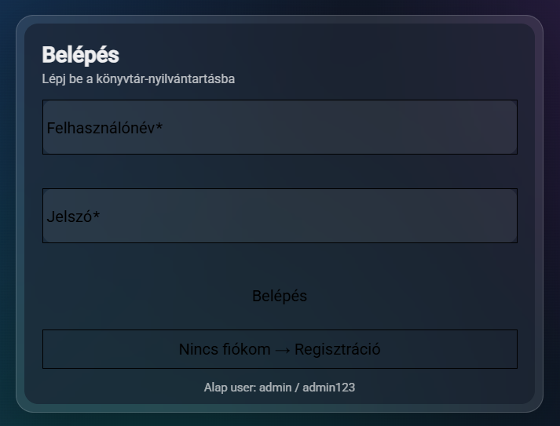
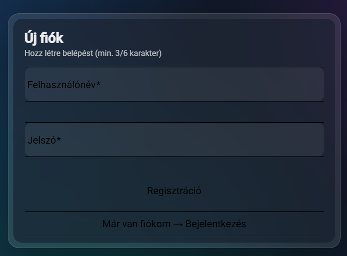
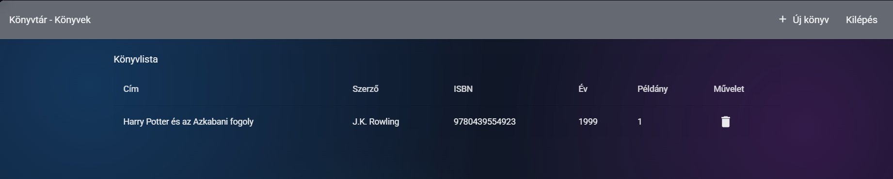
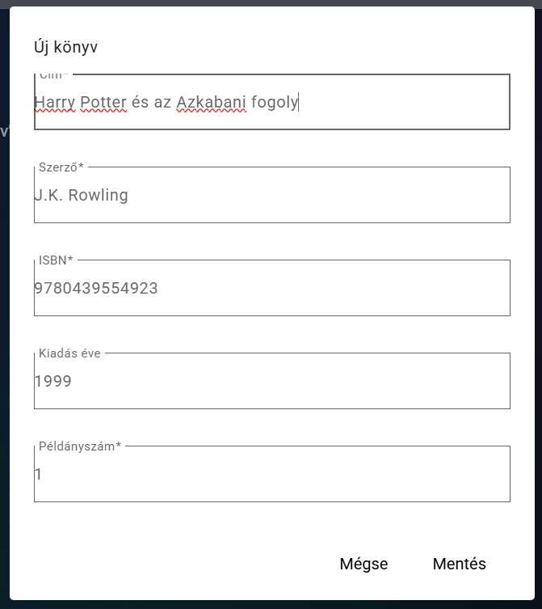

# Library Registry

Modern webes könyvtár nyilvántartó rendszer Angular, Node.js és MongoDB technológiákkal.

---

## Projekt célja

A rendszer célja könyvek nyilvántartása webes felületen keresztül, felhasználói bejelentkezéssel és adatbázis kapcsolattal.

A felhasználó képes:

* regisztrálni
* bejelentkezni
* könyveket megtekinteni
* új könyvet hozzáadni
* könyvet törölni
* ISBN adatot validálni

---

## Felhasznált technológiák

### Frontend

* Angular
* Angular Material
* TypeScript
* SCSS

### Backend

* Node.js
* Express.js
* JWT Authentication
* bcrypt

### Adatbázis

* MongoDB
* Mongoose

---

## Projekt struktúra

```text
library_registry/
│
├── frontend/
│   ├── src/
│   ├── package.json
│
├── backend/
│   ├── src/
│   ├── package.json
│
└── README.md
```

---

## Funkciók

### Felhasználó kezelés

* Regisztráció
* Bejelentkezés
* JWT tokenes védelem
* Kijelentkezés

### Könyv kezelés

* Könyvek listázása
* Új könyv hozzáadása
* Könyv törlése
* Táblázatos megjelenítés

### Validáció

* Kötelező mezők ellenőrzése
* ISBN formátum ellenőrzés
* Hibakezelés snackbar üzenetekkel

---

## Adatbázis modellek

### User

```json
{
  "username": "admin",
  "passwordHash": "..."
}
```

### Book

```json
{
  "title": "Clean Code",
  "author": "Robert C. Martin",
  "isbn": "9780132350884",
  "year": 2008,
  "copies": 3
}
```

---

## Telepítés

## 1️Repository klónozása

```bash
git clone <repository-url>
cd library_registry
```

---

## 2️Backend indítása

```bash
cd backend
npm install
npm run dev
```

---

## Frontend indítása

```bash
cd frontend
npm install
ng serve
```

---

## Elérés

Frontend:

```text
http://localhost:4200
```

Backend API:

```text
http://localhost:3000
```

---

## Alap belépési adatok

```text
Felhasználónév: admin
Jelszó: admin123
```

---

## Képernyőképek

Ide helyezhető:

Login oldal
  
  
Regisztráció oldal
  
  
Könyvlista
  
  
Új könyv hozzáadása
  

---

## Biztonság

* JWT token alapú védelem
* bcrypt jelszó titkosítás
* Védett végpontok

---

## API végpontok

### Auth

```text
POST /auth/register
POST /auth/login
```

### Books

```text
GET    /books
POST   /books
DELETE /books/:id
```

---

## Továbbfejlesztési lehetőségek

* Könyv szerkesztés
* Keresés
* Rendezés
* Saját könyvlista felhasználónként
* Admin jogosultság
* Kölcsönzés kezelés
* Statisztikák

---
